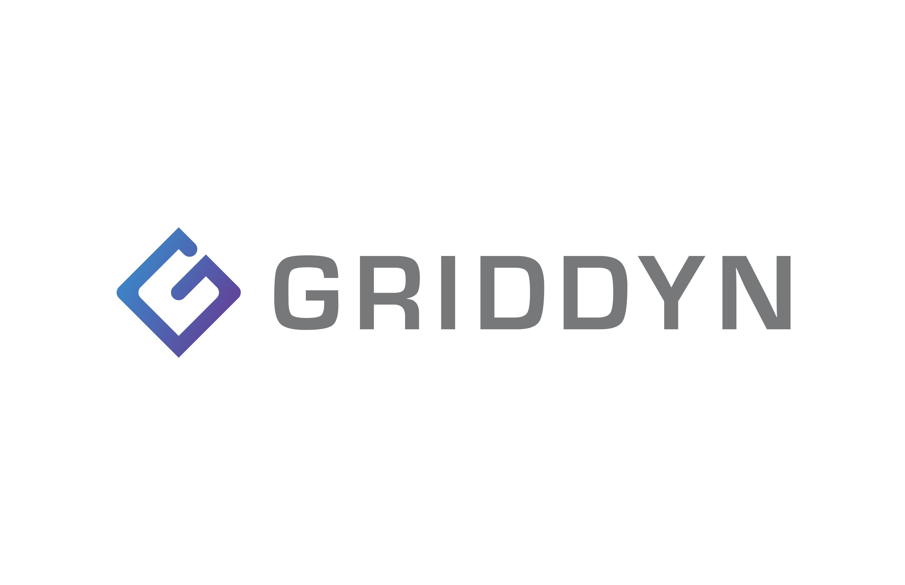

============

GridDyn is a power system simulator developed at Lawrence Livermore National Laboratory. 
The name is a concatenation of Grid Dynamics, and as such usually pronounced as "Grid Dine". 
It was created to meet a research need for exploring coupling between transmission, distribution, and communications system simulations.  
While good open source tools existed on the distribution side,  the open source tools on the transmission side were limited in usability 
either in the language or platform or simulation capability, and commercial tools while quite capable simply did not allow the access 
to the internals required to conduct the research.    Thus the decision was made to design a platform that met the needs of the research project.  
Building off of prior efforts in grid simulation, GridDyn was designed to meet the current and future research needs of the various grid related 
research and computational efforts.  It is written in C++ making use of recent improvements in the C++ standards.  It is intended to be cross platform with 
regard to operating system and machine scale.  The design goals were for the software to be easy to couple with other simulation, 
and be easy to modify and extend.  It is very much still in development and as such, the interfaces and code is likely to change, 
in some cases significantly as more experience and testing is done.   It is our expectation that the performance, reliability, 
capabilities, and flexibility will continue to improve as projects making use of the code continue and new ones develop.  
We expect there are still many issues so any bug reports or fixes are welcome.   
 And hopefully even in its current state and as the software improves the broader power systems research community will find it useful.

**The public library is initial construction phases and likely will have some issues as we finalize the release and get it working over the next week or so**

Documentation
----------------

[**Users Guide**](docs/manuals/GridDynUserManual.pdf)

** API Guide ** --coming soon

Also available are a series of presentations
	* [Intro] (docs/presentations/Griddyn_intro.pptx)
	* [Execution Flow] (docs/presentations/GridDyn_execution_flow.pptx)
	* [Objects] (docs/presentations/GridDyn_objects.pptx)
	* [Object Construction and properties] (docs/presentations/GridDyn_object_construction_and_properties.pptx)
	* [States and offsets] (docs/presentations/stateData_solverModes_solverOffsets.pptx)
	* [Validation and Performance] (docs/presentations/GridDyn_validation_and_performance.pptx)

Installation
------------------------
[Installation Guide](installation.md) file.

Get Involved!
------------------------

GridDyn is an open source project.  Questions, discussion, and
contributions are welcome. Contributions can be anything from new
packages to bugfixes, or even new core features.  We are actively working on improving it and 
making it better, as well as development related to specific projects.  

### Contributions

We are still working out the details of accepting contributions
For the moment you can submit a
[pull request](https://help.github.com/articles/using-pull-requests/).
and we can work with you to make sure the licensing is order, which basically involves making sure your contributions are released back to the repo under a BSD license like the rest of the code.  

Before you send a PR, your code should pass all the non-experimental test cases in testSystem, testLibrary, and testComponents

If the code is a new feature or new model, it should have additional test cases explicitly testing it

A style check is periodically run on the code to ensure consistent indentation and spacing.   While some style guidence has been followed it is not rigorously enforced yet.
A more formal style guide will likely evolve in the near future.  

The current git master branch is considered expirimental so there is no stable branch to maintain as everything is in development.  It is anticipated a more formal branching structure will be defined once the code base undergoes more testing and validation, and other features are added.  

Authors
----------------
GridDyn was originally written by Philip Top, top1@llnl.gov. 
A number of other people have contributed, see the Users Guide for more details

Release
----------------
GridDyn is released under a BSD license.  For more details see the
[LICENSE](LICENSE) file.

``LLNL-CODE-681053``
