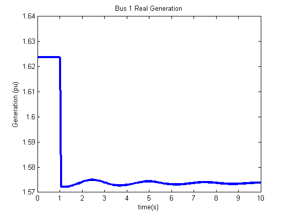
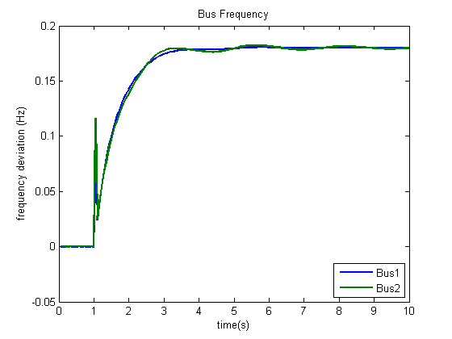
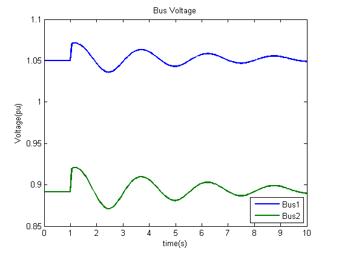

#Quick Start Guide

See the [installation guide](installation.md) or the [Users Guide](docs/manuals/GridDynUserManual.pdf) for installation instructions

## Running the tests
There are a few test programs built with GridDyn if enabled. They can be found in the build directory or the installtion directorry in a folder called test.  The 4 that exist currently
are testLibrary which tests out functionality in the libraries that GridDyn uses,  testComponents which tests out component models, testSystem which test complete system execution.
There is also testExtra which runs some scaling studies and timing tests and is not used as part of the unit testing system.  

```
$ ./testLibrary
Running 59 test cases...
unable to open file C:/Users/top1/Documents/codeProjects/GridDyn/test/test_files/element_reader_tests/xmlElementReader_missing_file.xml
NOTE:: this should have a message about a missing file >>testing bad file input
file read error in C:/Users/top1/Documents/codeProjects/GridDyn/test/test_files/element_reader_tests/xmlElementReader_test2.xml::* Line 1, Column 1
  Syntax error: value, object or array expected.

NOTE:: this should have a message indicating format error >>testing bad file input
Couldn't load C:/Users/top1/Documents/codeProjects/GridDyn/test/test_files/element_reader_tests/xmlElementReader_testbbad.xml <ticpp.cpp@809>
Description: Failed to open file
File: C:/Users/top1/Documents/codeProjects/GridDyn/test/test_files/element_reader_tests/xmlElementReader_testbbad.xml
Line: 0
Column: 0
NOTE:: this should have a message testing bad xml input and not fault
WARNING(1): unrecognized generator  parameter badparam
Couldn't load C:/Users/top1/Documents/codeProjects/GridDyn/test/test_files/xml_tests/test_bad_xml.xml <ticpp.cpp@809>
Description: Error reading end tag.
File: C:/Users/top1/Documents/codeProjects/GridDyn/test/test_files/xml_tests/test_bad_xml.xml
Line: 54
Column: 22
WARNING(1): Unable to open FileC:/Users/top1/Documents/codeProjects/GridDyn/test/test_files/xml_tests/test_bad_xml.xml
NOTE: this was supposed to have a failed file load to check error recovery

*** No errors detected
```

The others should produce output with several message including some labeled warnings and errors and a `*** No errors detected` if everything is working properly.  The error messages that do show up are from the solver and from which GridDyn can often recover.  

## running some examples 

In the install/bin folder there is an executable named gridDynMain
there also should be several example files in the install/examples directory

```
$ ./griddynMain.exe ../examples/two_bus_example.xml
area count =0 buses=2 links= 1 gens= 1
(PRESTART)[sim]::GridDyn version 0.5.0 2016-08-20

Simulation gridDynSim_103 executed in 0.0020001 seconds
simulation final Power flow statesize= 4, 10 non zero elements in Jacobian
```

Running this with an output file produces

```
$ ./griddynMain.exe ../examples/two_bus_example.xml --powerflow-output=output.txt
area count =0 buses=2 links= 1 gens= 1
(PRESTART)[sim]::GridDyn version 0.5.0 2016-08-20

Simulation gridDynSim_103 executed in 0.0130008 seconds
simulation final Power flow statesize= 4, 10 non zero elements in Jacobian
```

and an output file output.txt

```
gridDynSim_103 basepower=100.000000
Simulation 2 buses 1 lines
===============BUS INFORMATION=====================
Area#	Bus#	Bus name				voltage(pu)	angle(deg)	Pgen(MW)	Qgen(MW)	Pload(MW)	Qload(MW)	Plink(MW)	Qlink(MW)
1		 3		 "bus1                "	 1.050000	   0.0000	 -162.37689	 0.00000	 115.00000	 31.00000	 47.37689	 22.60654
1		 4		 "bus2                "	 0.891033	 -13.6449	 0.00000	 0.00000	 45.00000	 20.00000	 -45.00000	 -20.00000
===============LINE INFORMATION=====================
Area#	Line #	Line Name					from	to		P1_2		Q1_2		P2_1		Q2_1		Loss
1		 1		"bus1_to_bus2        "	     3,     4	 47.37689	 22.60654	 -45.00000	 -20.00000	 2.37689
===============AREA INFORMATION=====================
Area#	Area Name				Gen Real	 Gen Reactive	 Load Real	 Load Reactive	 Loss	 Export
1		"gridDynSim_103      "	 -162.38	    0.00	  160.00	   51.00	    2.38	 -99999.00
```

Running a dynamic simulation is similar

```
$ ./griddynMain.exe ../examples/two_bus_dynamic_example.xml
area count =0 buses=2 links= 1 gens= 1
(PRESTART)[sim]::GridDyn version 0.5.0 2016-08-20
(10.000000)[sim]::saving recorder output:twobusdynout.csv

Simulation gridDynSim_103 executed in 0.0110006 seconds
simulation final Dynamic statesize= 15, 0 non zero elements in Jacobian
```

In this example, at 1.0 seconds into the simulation the load on Bus1 is decreased by 0.1 pu.  The generator frequency increases from the excess power production, and as the frequency increases the governor decreases the output pwer stabilizing the frequency.  
There is also a small rise in the bus voltages.
The resulting output file is a CSV file so it can be read in a variety of software packages.  In the Matlab folder of the repo is a Matlab class name timeSeries2 that can read both the csv and binary output
files from the recorders in GridDyn dynamic simulations.

```
>>ts=timeSeries2('C:\msys64\home\top1\GridDyn\install\bin\twobusdynout.csv');
>> ts

ts = 

  timeSeries2 with properties:

    description: '# gridDynSim_103_recorder:'
           time: [202x1 double]
           data: [202x8 double]
           cols: 8
          count: 201
         fields: {1x8 cell}
>> ts.fields'

ans = 

    'bus1:voltage'
    'bus2:voltage'
    'bus1:angle'
    'bus2:angle'
    'bus1:busgenerationreal'
    'bus2:busgenerationreal'
    'bus1:busloadreal'
    'bus2:busloadreal'
```

The data can plotted using the Matlab utilities.
The following script does the plotting

``` matlab
 ts=timeSeries2('C:\msys64\home\top1\GridDyn\install\bin\twobusdynout.csv');
 figure(1)
 hold off;
 plot(ts.time,-ts(5),'LineWidth',3);
 title('Bus 1 Real Generation');
 ylabel('Generation (pu)');
 xlabel('time(s)');
 
 figure(2);
 hold off;
 freq1=diff(ts(3))./diff(ts.time)/(2.0*pi);
 freq2=diff(ts(4))./diff(ts.time)/(2.0*pi);
 plot(ts.time(2:end),freq1,ts.time(2:end),freq2,'LineWidth',2);
 legend('Bus1','Bus2','Location','SouthEast');
 title('Bus Frequency');
 xlabel('time(s)');
 ylabel('frequency deviation (Hz)');
 
 figure(3);
 hold off;

 plot(ts.time,ts(1:2),'LineWidth',2);
 legend('Bus1','Bus2','Location','SouthEast');
 title('Bus Voltage');
 xlabel('time(s)');
 ylabel('Voltage(pu)');
 ```
 
 The results are shown in the next few figures
 
 
 
 
 Some more details on the input files themselves and the model described by these examples can be found in
 [Example details] (docs/presentations/GridDyn_execution_flow.pptx) slides 7 through 23.
